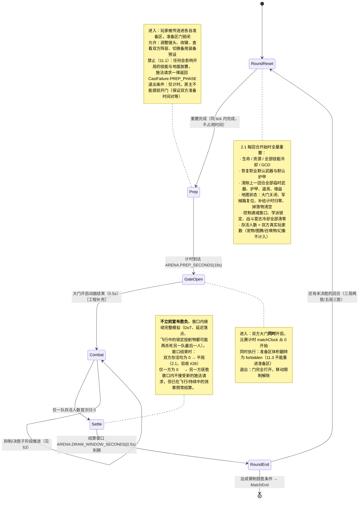
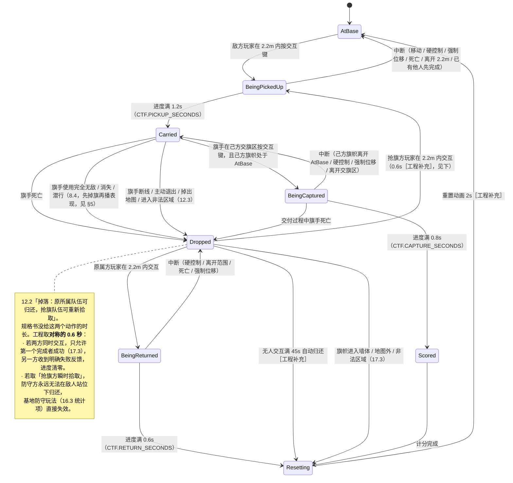

# 模式规则与地图设计

> 对应规格书第 2、3、11、12 章。本文是 **M5（竞技场模式与地图）** 与 **M7（夺旗战场）** 的实现基线。
> 凡是规格书直接给出的数值，用「规格书 X.Y」标注；凡是规格书只给了定性描述、由工程侧补齐的数值，
> 一律标注 **［工程补充］**，改动这些值不需要改规格书，但必须改本文。

---

## 1. 模式总表（规格书 2）

| 模式 | 人数 | 地图 | 胜利条件 | 复活 | 默认时长 | 临时武装 | 防拖延 |
|---|---|---|---|---|---|---|---|
| 2v2 竞技场 | 2 人/队 | 小型封闭地图 | 歼灭全部敌人 | 无 | 5 分钟 | 可开启 | 战斗抑制 + 决胜阶段 |
| 3v3 竞技场 | 3 人/队 | 标准竞技场地图 | 歼灭全部敌人 | 无 | 6 分钟 | 可开启 | 战斗抑制 + 决胜阶段 |
| 5v5 竞技场 | 5 人/队 | 较大竞技场地图 | 歼灭全部敌人 | 无 | 7 分钟 | 可开启 | 战斗抑制 + 决胜阶段 |
| 6v6 夺旗 | 6 人/队 | 中型夺旗地图 | 率先完成夺旗 | 波次复活 | 12 分钟 | 首版关闭 | 旗手聚焦 + 加时 |
| 8v8 夺旗 | 8 人/队 | 中大型夺旗地图 | 率先完成夺旗 | 波次复活 | 15 分钟 | 首版关闭 | 旗手聚焦 + 加时 |
| 12v12 夺旗 | 12 人/队 | 大型夺旗地图 | 率先完成夺旗 | 波次复活 | 15 分钟 | 首版关闭 | 旗手聚焦 + 加时 |

这张表已经逐字落进 `packages/shared/src/constants/combat.ts` 的 `ARENA.DURATION` 与 `CTF.DURATION`。
**代码里不允许再出现第二处时长常量**，模式配置一律从这里读。

> ⚠️ **实装的模式值比这张表多**，两处都是规格书之外的新增，登记在各自的章节：
> ① 竞技场从 2/3/5 三档放开到 **1v1–12v12 全梯子**（P12，2026-08-08 用户反馈
> 「12v12 很容易不满人」），地图按 `data/maps/arena.ts` 的 SPECS 梯子一次生成 12 张，
> 2/3/5 三张老图逐字节不变 —— 上表三行仍是它们的权威口径；
> ② 新增第三个模式 **大乱斗（FFA）**，见 §11。


### 1.1 模式标识与配置对象

```ts
export type ModeId =
  | 'arena2v2' | 'arena3v3' | 'arena5v5'
  | 'ctf6v6'   | 'ctf8v8'   | 'ctf12v12';

export interface ModeDef {
  id: ModeId;
  family: 'arena' | 'ctf';
  teamSize: number;
  /** 秒。来自 ARENA.DURATION / CTF.DURATION */
  duration: number;
  /** 竞技场无复活；夺旗按波次 */
  respawn: { kind: 'none' } | { kind: 'wave'; interval: number; overtimeInterval: number };
  /** 2.1 快速比赛单回合；自定义可三局两胜/五局三胜 */
  roundsToWin: 1 | 2 | 3;
  /** 10.1 经典 / 武装。夺旗首版强制 false（2.2）*/
  arsenalAllowed: boolean;
  /** 8.5 战斗抑制起始秒；ctf 为 undefined */
  dampeningStart?: number;
  /** 12.1 夺旗分数，房主可调 1~5 */
  scoreToWin?: number;
}
```

**为什么 `arsenalAllowed` 是模式字段而不是房间字段**：规格书 2.2 明确「夺旗模式首版不启用竞技场临时装备」。
如果做成房间开关，房主就能给夺旗打开它。做成模式字段 + 夺旗恒为 `false`，这条规则由类型系统保证，
而不是靠 UI 不给按钮。

### 1.2 赛制细则

| 项 | 竞技场（2.1） | 夺旗（2.2） |
|---|---|---|
| 默认赛制 | 单回合；自定义可三局两胜/五局三胜 | 单场；率先 3 次夺旗，房主可调 1–5 |
| 时间到 | 进入决胜阶段直到分出胜负 | 比分高者胜；平分进入突然死亡加时 |
| 平局 | 双方最后玩家同一结算窗口内死亡判平局 | 加时不设平局 |
| 职业锁定 | 整场锁定，退出重进不能换职业（3.2） | 同左 |
| 人数 | 标准要求双方相等；自定义可不平衡但必须标记为非标准 | 同左 |

---

## 2. 竞技场回合状态机（规格书 2.1 / 11.1 / 11.4）

实现位置：`packages/shared/src/sim/match/arena.ts`



### 2.1 存活人数的唯一定义

```ts
/** 2.1：宠物、图腾、召唤物和幻象不计入存活人数 */
const aliveCount = (world: World, team: TeamId): number =>
  world.entities.filter(
    (e) => e.team === team && e.kind === 'player' && e.deathState === 'alive',
  ).length;
```

- `kind === 'player'` 是唯一判据。宠物/图腾/召唤物/幻象的 `kind` 分别是 `'pet' | 'totem' | 'summon' | 'mirror'`，
  它们**永远不进入这个计数**，即使拥有生命值和碰撞体。
- `deathState` 是三态：`'alive' | 'feign' | 'dead'`。
  规格书 11.4 要求「假死、免死和临死形态必须与真实死亡明确区分，系统只在最终死亡时减少存活人数」，
  所以 `'feign'`（假死/临死形态/免死生效中）**不减少存活人数**，也不触发 `Settle`。

### 2.2 平局窗口为什么必须存在

如果在 `aliveCount === 0` 的那一 tick 立刻结束回合，胜负就取决于「本 tick 内两个死亡事件的处理顺序」，
而顺序取决于实体数组的遍历序 —— 这正是规格书 2.1 禁止的「按消息先后强行判定胜负」。
`Settle` 窗口把「零存活」从一个瞬时事件变成一个 0.5 秒的观察区间，双方在区间内都归零就是平局。

**测试断言（验收 #26）**：构造两个 DoT 分别在 t 与 t+0.3s 杀死双方最后一人 → 期望 `result === 'draw'`；
改成 t 与 t+0.8s → 期望先死方判负。

### 2.3 回合重置清单（2.1 逐条对照）

| 规格书原文 | 重置动作 | 实现位置 |
|---|---|---|
| 恢复生命 | `hp = maxHp`，清除全部护盾与吸收 | `arena.resetRound()` |
| 恢复资源 | 各职业资源回到 `ResourcePoolDef.startValue`（怒气归 0、法力满、能量满、连击点归 0） | 同上 |
| 恢复技能冷却 | 清空 `cooldowns`、`gcdUntil`、`schoolLocks` | 同上 |
| 恢复默认装备 | `loadout` 回到 `ClassDef.defaultWeapon / defaultArmor` | `sim/loadout.ts` |
| 恢复地图状态 | 大门、军械箱、补给计时、地面掉落物全部复位 | `sim/arsenal.ts` |
| 上一回合临时装备全部清除 | `loadout.spares = []`，地面残留掉落物销毁 | `sim/loadout.ts` |
| — | 附加：清空 DR 计数、光环、投射物、地面区域、战斗抑制层数 | `arena.resetRound()` |

> 这是一个「全量重建」而不是「逐项撤销」。`resetRound()` 直接丢弃整个战斗态对象并从 `ClassDef` 重建，
> 因为逐项撤销的代码每加一个新机制就多一个漏撤销的机会。

---

## 3. 战斗抑制与决胜阶段（规格书 8.5）

### 3.1 数值曲线

抑制百分比 D(t)，t 为回合计时（秒）：

```
D(t) = 0                                        当 t < T0
D(t) = min(0.90, 0.10 + 0.05 × floor((t - T0) / 30))   当 t ≥ T0

T0 = DAMPENING.START_SECONDS[mode]  → 2v2:60  3v3:90  5v5:120
0.10 = DAMPENING.INITIAL
0.05 / 30 = DAMPENING.STEP_AMOUNT / DAMPENING.STEP_INTERVAL
0.90 = DAMPENING.MAX（治疗不能被抑制到 0）
```

作用对象：**全部治疗与吸收**（含护盾、生命偷取、道具回血、猎人振奋）。
不作用于：伤害、控制时长、资源回复、移动速度。

### 3.2 时间轴

```
2v2（总时长 300s，抑制起点 60s）
 t:  0        60      90     120     150     180     210     240     270     300 ▼决胜
     │────────┼───────┼───────┼───────┼───────┼───────┼───────┼───────┼───────┤▶
 D%:  0        10      15      20      25      30      35      40      45     50 → 每15s +5%

3v3（总时长 360s，抑制起点 90s）
 t:  0            90     120     150     180     210     240     270     300  330  360 ▼决胜
     │────────────┼───────┼───────┼───────┼───────┼───────┼───────┼──────┼────┼────┤▶
 D%:  0            10      15      20      25      30      35      40     45   50   55

5v5（总时长 420s，抑制起点 120s）
 t:  0               120     150     180  …  360     390     420 ▼决胜
     │───────────────┼───────┼───────┼─────┼───────┼───────┼───┤▶
 D%:  0               10      15      20   …  50      55      60

图例：▼决胜 = 常规时长结束，进入决胜阶段；此后抑制步进间隔由 30s 缩短为 15s［工程补充］
```

### 3.3 决胜阶段（8.5 第 3 条）

规格书只给了定性要求：「所有玩家大致位置可见、潜行受限、抑制加速，并逐步加入不可完全免疫的竞技场压迫伤害」。
以下为落地方案，数值均为 ［工程补充］：

| 要素 | 规则 | 理由 |
|---|---|---|
| 大致位置可见 | 每 3 秒在小地图刷新一次所有玩家的**粗略坐标**（量化到 8 米格），不显示姓名板、不可被 Tab、不可被点击 | 规格书说「大致位置」不是「可选中」。做成粗粒度刷新，既能终结「满图躲猫猫」，又不让潜行者被直接秒选 —— 后者会毁掉盗贼职业。 |
| 潜行受限 | 进入决胜阶段后，潜行/隐身的**位置标记照常上报**；潜行仍隐藏姓名板与选中资格（5.3 不变） | 只削弱「藏起来拖时间」，不削弱「潜行接近开先手」 |
| 抑制加速 | 步进间隔 30s → **15s**，上限仍为 `DAMPENING.MAX` 90% | 治疗职业互拖会在约 3 分钟内被压到下限 |
| 竞技场压迫伤害 | 进入决胜 15 秒后开始，每秒造成 `最大生命 × (0.5% + 0.25% × 已过去的每 15 秒)` 的**真实伤害** | 曲线加速，避免高血量职业（死骑 1200）明显比法师（900）多活很久 |
| 不可完全免疫 | 压迫伤害标记为 `bypassImmunity: true`，圣盾术/寒冰屏障/保护祝福都不能免疫，也不能被吸收护盾抵消 | 8.5 明文「不可完全免疫」；否则免疫职业能白嫖 4 秒 |

**实现要点**：压迫伤害走独立的 `EffectDef.kind === 'arenaPressure'` 处理器，
在 `sim/dampening.ts` 里由 matchRules 阶段直接施加，**不经过光环系统**，
因为光环系统里所有伤害都要过免疫/吸收/减伤链，而这条伤害必须绕开它。

---

## 4. 夺旗流程与旗帜状态机（规格书 12.1 / 12.2）

实现位置：`packages/shared/src/sim/flag.ts`

### 4.1 得分流程（12.1）

```
1. 进入敌方基地
2. 在 2.2 米（RANGE.INTERACT）交互距离内持续 1.2 秒（CTF.PICKUP_SECONDS）拔起敌方旗帜
3. 携带旗帜返回己方基地
4. 确保己方旗帜位于己方基地   ← 这是一个**持续条件**，不是一次性检查
5. 在交旗区域持续 0.8 秒（CTF.CAPTURE_SECONDS）完成交付，获得 1 分
```

第 4 步的措辞很关键：规格书 12.2「交付中」一行写的是「己方旗帜必须**持续**在基地」。
所以交旗的 0.8 秒里每个 tick 都要重新检查己方旗帜状态，中途被拔走则交付立即失败（不是失败后仍得分）。

### 4.2 七种旗帜状态完整转移图



### 4.3 转移参数速查表

| 转移 | 持续时间 | 来源 | 中断条件 | 中断后落点 |
|---|---|---|---|---|
| AtBase → BeingPickedUp → Carried | 1.2s | `CTF.PICKUP_SECONDS`（12.1） | 移动、硬控制、强制位移、死亡、离开 2.2m、他人抢先 | AtBase |
| Dropped → BeingPickedUp → Carried | 0.6s ［工程补充］ | 与归还对称 | 同上 | Dropped（原地） |
| Dropped → BeingReturned → Resetting | 0.6s | `CTF.RETURN_SECONDS`（12.2） | 硬控制、离开范围、死亡、强制位移 | Dropped（原地） |
| Carried → BeingCaptured → Scored | 0.8s | `CTF.CAPTURE_SECONDS`（12.1） | 己方旗帜离开基地、硬控制、强制位移、离开交旗区 | Carried（保留旗帜） |
| Carried → Dropped | 即时 | 12.3 | — | 旗手**最后一个合法位置** |
| Dropped → Resetting（自动） | 45s ［工程补充］ | — | 任一方成功交互 | — |
| Resetting → AtBase | 2s ［工程补充］ | — | 不可中断 | — |

**「普通伤害不中断」**：与 10.5 拾取规则一致，拔旗/归还/交旗的进度条**不被普通伤害打断**，
只被移动、硬控制、强制位移和死亡打断。否则任意一个 DoT 就能永久锁死归还。

**掉落位置的定义（12.3 最后一条）**：
```ts
// 旗手每 tick 记录一次「最后合法位置」——站在可站立面上、不在 forbidden 体积内
if (isStandable(pos) && !inForbiddenVolume(pos)) carrier.lastLegalPos = pos;
// 掉旗时
flag.position = carrier.lastLegalPos ?? flagSite.homePosition; // 无法确定时直接回基地
```

---

## 5. 旗手限制清单（规格书 12.3 / 8.4）

| # | 限制 | 实现手段 | 涉及技能 |
|---|---|---|---|
| 1 | 旗手不能潜行 | `SkillDef.forbiddenWhileCarryingFlag = true`，按下时返回 `CastFailure.CARRYING_FLAG`，**技能不进冷却** | 盗贼「潜行」、德鲁伊猎豹形态下的潜行 |
| 2 | 旗手不能完全隐身 | 同上 | 任何 `invisibility` 光环来源 |
| 3 | 旗手不能使用坐骑 / 飞行 | 首版无坐骑，接口预留同一个 flag | — |
| 4 | 旗手不能跨越大段地图的传送 | 位移距离 > 20 米的技能加 `forbiddenWhileCarryingFlag` | 首版无此类技能，规则预置 |
| 5 | **使用完全无敌 / 消失 / 潜行时先掉旗，再播放技能表现** | `SkillDef.dropsFlagOnUse = true`，在效果管线的 **pre-effect 阶段**处理 | 圣骑士「圣盾术」、圣骑士「保护祝福」（作用于旗手时）、法师「寒冰屏障」、盗贼「消失」 |
| 6 | 短距离冲锋、闪现、跳跃保留但距离降低 | `carryingFlagRangeFactor = 0.6`［工程补充］，且必须过 `clampDisplacement` 落点合法性 | 战士冲锋、法师闪现、猎人逃脱、盗贼暗影步（暗影步另有 #1 限制）、德鲁伊野性冲锋 |
| 7 | 旗手移动加成存在总上限 | `CTF.FLAG_CARRIER_MAX_SPEED_BONUS = 0.10`，聚合层对旗手单独截顶 | 群奔咆哮（12.3 明文：旗手自身最多获得 10%）、死亡脚步、机动型护甲 |
| 8 | 德鲁伊熊形态可持旗，猎豹潜行不可持旗 | 熊形态无标记；猎豹形态允许，但形态内的潜行走 #1 | 德鲁伊 |
| 9 | 断线 / 退出 / 掉出地图 / 进入非法区域时旗帜落在最后合法位置 | 见 §4.3 `lastLegalPos` | 全职业 |

### 5.1 「先掉旗再播放技能表现」的时序（验收 #40）

这是最容易实现错的一条。错误实现会产生「旗帜跟着隐身的人一起消失」的一帧，
或者更糟：无敌先生效，掉旗时旗帜被当作无敌单位的附属物一起被保护。

正确的执行顺序，在 `sim/casting.ts` 的成功释放分支里：

```
成功释放（7.4 第 5 步已通过全部合法性检查）
  │
  ├─ ① 消耗资源、进入技能冷却                      ← 与旗帜无关，先做完
  │
  ├─ ② pre-effect：若 skill.dropsFlagOnUse 且施法者持旗
  │      · flag.state: Carried → Dropped
  │      · flag.position = caster.lastLegalPos
  │      · flag.carrier = null
  │      · 发出事件 FlagDropped{ seq: N }
  │      · 事件 seq 必须 **小于** 后续 AuraApplied 的 seq
  │
  ├─ ③ 施加效果：无敌 / 潜行 / 消失光环生效
  │      · 发出事件 AuraApplied{ seq: N+1 }
  │
  └─ ④ 客户端按 seq 顺序回放：先看到旗帜落地，再看到金色护罩/烟雾
```

**为什么必须在同一 tick 内、且按 seq 排序**：
快照是按事件序列回放的。如果 `AuraApplied` 先于 `FlagDropped` 到达客户端，
客户端会先把角色渲染成隐身/无敌，此时旗帜模型还挂在角色挂点上，就会跟着一起消失一帧。
验收 #40 原文是「旗帜不会随角色隐藏」—— 一帧也不行。

**单测**：释放圣盾术 → 断言事件流中 `FlagDropped.seq < AuraApplied.seq`，
且 `FlagDropped` 与 `AuraApplied` 的 `tick` 相同（不能拖到下一 tick，否则出现「无敌带旗跑一 tick」）。

---

## 6. 同时持旗与战场聚焦（规格书 12.4）

### 6.1 规则

- 双方**可以**同时携带对方旗帜；比赛继续进行。
- 己方旗帜不在基地时**不能得分**（验收 #39）—— 这是 `Carried → BeingCaptured` 的前置条件。
- 同时持旗超过 60 秒（`CTF.FOCUS_GRACE_SECONDS`）后，双方旗手获得**战场聚焦**：
  每 30 秒（`CTF.FOCUS_STACK_INTERVAL`）叠加 1 层，最多 5 层（`CTF.FOCUS_MAX_STACKS`）。
- 每层效果：受到伤害 **+8%**（`FOCUS_DAMAGE_TAKEN_PER_STACK`）、受到治疗 **−5%**（`FOCUS_HEALING_TAKEN_PER_STACK`）。
- 任意一面旗帜返回基地后停止继续叠加并逐步清除。

### 6.2 叠层时间轴

```
双方同时进入 Carried
 t:  0 ────────────────── 60 ──── 90 ──── 120 ──── 150 ──── 180 ──── 210 ──▶
              宽限期            │       │        │        │        │
 层数:        0                 1       2        3        4        5（封顶）
 受伤:       +0%              +8%     +16%     +24%     +32%     +40%
 受治:        0%              −5%     −10%     −15%     −20%     −25%

 任一旗帜回到 AtBase
 t: ────────▶ 停止叠加，每 5 秒衰减 1 层［工程补充］，直到 0
```

### 6.3 叠层挂在旗帜上，不挂在玩家上

```ts
interface FlagState {
  // …
  /** 12.4 战场聚焦层数。存在旗帜上而不是旗手上 */
  focusStacks: number;
  /** 双方同时持旗的累计秒数，只在两面旗都处于 Carried 时推进 */
  dualCarryElapsed: number;
}
```

**理由**：如果层数挂在玩家身上，队伍只要「旗手 A 掉旗给旗手 B」就能把层数清零，
60 秒的宽限期会被无限重置，12.4 的防拖延机制彻底失效。
挂在旗帜上，则新旗手在 `Dropped → Carried` 的瞬间**立即继承当前层数**，传旗不产生任何收益。

**同样地，`dualCarryElapsed` 只在两面旗都是 `Carried` 时推进**，任一面进入 `Dropped` 就暂停（不清零）。
暂停而非清零，是为了防止「故意反复掉旗捡旗」重置计时；清零只发生在旗帜真正 `AtBase` 之后。

### 6.4 加时赛（2.2）

- 常规时间结束、比分相同 → 进入突然死亡加时。
- 加时赛规则：**第一次得分即获胜**；复活波次间隔由 12s 改为 16s（`CTF.RESPAWN_WAVE_SECONDS_OVERTIME`）。
- 加时赛开始时，双方旗帜强制 `Resetting → AtBase`，聚焦层数清零，所有旗手掉旗。
  理由：加时是一场新的争夺，让上半场遗留的 5 层聚焦决定胜负不公平。［工程补充］

---

## 7. 复活波次（规格书 12.6）

| 参数 | 值 | 常量 |
|---|---|---|
| 复活波次间隔 | 12 秒 | `CTF.RESPAWN_WAVE_SECONDS` |
| 加时赛波次间隔 | 16 秒 | `CTF.RESPAWN_WAVE_SECONDS_OVERTIME` |
| 复活保护 | 3 秒 | `CTF.SPAWN_PROTECTION_SECONDS` |

### 7.1 波次调度

```
全局波次计时器（每队一个，从比赛开始就在跑，与死亡无关）
  ├─ t = 0, 12, 24, 36 … 触发一次波次
  └─ 每次波次：把该队 deathQueue 里的所有玩家一次性复活并清空队列

玩家死亡 → 进入 deathQueue，HUD 显示「下次复活倒计时 = 下一个波次时刻 − 现在」
```

**为什么用全局计时器而不是「死后 12 秒复活」**：
12.6 写的是「按固定复活波次重返战场」。波次制的战术意义是——同队死亡的人会**成批回来**，
形成有节奏的团队推进；个人计时制会让复活变成一股连续细流，团战节奏完全消失。

### 7.2 复活保护（3 秒）

保护内容：免疫全部伤害与控制，但**不免疫强制位移**（否则可以站在复活区门口当路障）。

提前结束条件（12.6 明文「主动攻击、治疗或使用技能会提前结束」）：

| 动作 | 是否结束保护 |
|---|---|
| 移动、跳跃、转向、切换目标、切换形态 | 否 |
| 普通攻击 / 自动射击开始 | 是 |
| 任何 `SkillDef` 释放成功（含自身增益、治疗、解控） | 是 |
| 使用主动增益道具 | 是 |
| **开始拔旗 / 归还 / 交旗交互** | **是（在交互开始的那一 tick 立即移除）** |
| 受到伤害 | 否（免疫掉，保护继续） |

最后一条对应 12.6「复活保护不能用于直接完成拔旗或交旗」。
实现上是「交互开始 → 立即移除保护」，而不是「持旗时禁止交互」，
因为前者语义更简单，也顺带覆盖了「带保护归还旗帜」这个规格书没写但同样不该允许的情况。

### 7.3 复活区约束（12.5）

- 复活区至少两个出口 → `MapDef.graveyards[].exits.length >= 2`，单测断言。
- 敌人不能进入安全区域 → 复活区体积标记 `forbidden: { forTeam: 'enemy' }`，
  移动求解与 `clampDisplacement` 都会拒绝把敌方实体放进去。
- 不能从复活区直接攻击旗帜房 → 单测断言：复活区内任一可站立点到敌方旗帜位置**均无视线**
  （用 `hasLineOfSight` 对复活区做 1 米网格采样）。
- 不造成永久堵门（验收 #43）→ 复活点选择算法：每次波次为每个玩家选择**当前 2 米内实体最少**的复活点；
  且玩家碰撞是软碰撞（见 `docs/07` §3.7），本身就不构成实体堵门。

---

## 8. 地图数据格式

实现位置：`packages/shared/src/data/maps/*.ts`
遵循 [02-architecture.md](02-architecture.md) §6：**首版用 AABB 组合描述地形，不引入网格碰撞或物理引擎。**

### 8.1 `MapDef` 建议接口

```ts
import type { Aabb, Vec3 } from '../../math/geometry.js';

export type MapId = string & { readonly __brand: 'MapId' };
export type TeamId = 'red' | 'blue';

// ── 几何体：Aabb 的语义化包装 ──────────────────────────────────
export interface MapVolume extends Aabb {
  id: string;
  /**
   * 语义标签。只影响渲染选材与调试可视化，判定一律看 Aabb 上的三个 flag。
   * rail/低矮栏杆请显式写 blocksSight:false（6.4）
   */
  tag:
    | 'wall' | 'pillar' | 'roof' | 'floor' | 'ramp' | 'rail'
    | 'arch'      // 拱门：blocksMovement:false, blocksSight:false（6.4 允许效果传播）
    | 'water'     // 13.5 深水可终止坠落伤害
    | 'gate';     // 11.1 大门，状态可变
  /** 顶面是否可站立。false 表示装饰体，位移技能不能落在上面 */
  standable?: boolean;
  /** 碰撞投射物是否被阻挡（6.6）。默认跟随 blocksMovement */
  blocksProjectile?: boolean;
}

// ── 出生与准备 ────────────────────────────────────────────────
export interface SpawnPoint {
  id: string;
  team: TeamId;
  position: Vec3;
  /** 出生朝向，弧度。竞技场统一朝向中央 */
  yaw: number;
}

export interface PrepRoom {
  id: string;
  team: TeamId;
  /** 11.1 准备区体积 */
  volume: Aabb;
  spawns: readonly SpawnPoint[];
  /** 与主场地之间的大门 */
  gateId: string;
  /**
   * 11.3「玩家不能重新进入准备区躲避」
   * 开门后该体积翻转为对**所有人**禁入
   */
  reentry: 'blocked';
}

export interface Gate {
  id: string;
  volume: Aabb;
  /** 开门时刻（秒，相对回合开始）。竞技场为 0，即 Prep 结束瞬间 */
  opensAt: number;
  /** 开门动画时长，期间仍阻挡移动 */
  openDuration: number;
}

// ── 禁入体积（11.3 / 12.5 / 17.3）────────────────────────────
export interface ForbiddenVolume {
  id: string;
  volume: Aabb;
  /** 'all' = 边界与观众席；'enemy' = 复活区，只禁敌方 */
  scope: 'all' | { forTeam: TeamId };
  /** 越界处置：推回最近合法点 / 直接传送回出生点 */
  onEnter: 'pushBack' | 'teleportToSpawn';
}

// ── 武装竞技场补给（10.4）─────────────────────────────────────
export interface SupplyPoint {
  id: string;
  kind: 'armory' | 'drop';       // 中立军械箱 / 实体掉落
  position: Vec3;
  /** 首次刷新与后续间隔，秒 */
  firstSpawnAt: number;
  respawnInterval: number;
  /** 2v2 只允许一个 primary；3v3 一个 primary + 轮换 side；5v5 中央 + 两侧 + 战术点 */
  role: 'primary' | 'side' | 'tactical';
}

// ── 夺旗设施（12.5）───────────────────────────────────────────
export interface FlagSite {
  id: string;
  team: TeamId;            // 旗帜归属方（敌方来拔）
  position: Vec3;
  /** 旗帜房入口列表，12.5 要求至少两个 */
  entrances: readonly Vec3[];
}

export interface CaptureZone {
  id: string;
  team: TeamId;            // 该队在此交旗
  volume: Aabb;
}

export interface Graveyard {
  id: string;
  team: TeamId;
  volume: Aabb;
  spawns: readonly SpawnPoint[];
  /** 12.5 至少两个出口 */
  exits: readonly Vec3[];
}

// ── 路线提示（12.5 / HUD 小地图）─────────────────────────────
export interface RouteHint {
  id: string;
  kind: 'center' | 'flank' | 'underground';
  /** 折线航点，用于小地图绘制与路径长度校验 */
  waypoints: readonly Vec3[];
  /** 12.5 每条主路线至少两个出口 */
  exits: readonly Vec3[];
}

// ── 可缩放（19.1：一张夺旗地图服务 6v6 / 8v8 / 12v12）─────────
export interface MapScaling {
  /** 本模式下开启的大门/通道 id */
  openGates: readonly string[];
  /** 本模式下额外封闭的区域（缩小有效战场） */
  extraForbidden: readonly string[];
  /** 每队使用的出生点数量 */
  spawnsPerTeam: number;
  /** 每队复活区出口数量（人越多出口越多，防堵门，验收 #43）*/
  graveyardExits: number;
}

// ── 主体 ──────────────────────────────────────────────────────
export interface MapDef {
  id: MapId;
  name: string;
  family: 'arena' | 'ctf';
  modes: readonly ModeId[];

  /** 地图外边界。越界触发 17.3 重置 */
  bounds: Aabb;
  /** 唯一的碰撞与视线真相。客户端渲染网格必须由它生成 */
  geometry: readonly MapVolume[];
  forbidden: readonly ForbiddenVolume[];

  prepRooms?: readonly PrepRoom[];      // arena
  gates: readonly Gate[];
  supplyPoints?: readonly SupplyPoint[]; // 武装竞技场

  flags?: readonly FlagSite[];          // ctf
  captureZones?: readonly CaptureZone[];
  graveyards?: readonly Graveyard[];
  routes?: readonly RouteHint[];
  scaling?: Partial<Record<ModeId, MapScaling>>;

  /** 11.3 公平约束的机器可校验结果，由构建期脚本填充 */
  fairness: FairnessAudit;
}
```

### 8.2 客户端渲染网格由 `geometry` 生成

`MapDef.geometry` 里的每个 `MapVolume` 在客户端直接生成一个 `THREE.BoxGeometry`。
**不允许美术单独提供一份场景 glTF 再由程序「大致对齐」碰撞盒** —— 那会立刻违反验收 #8
（真实范围边界与实际判定一致）与 #11（墙柱门正确挡视线）。
装饰性模型（旗杆、火盆、雕像）可以额外挂载，但必须 `standable: false` 且不参与任何判定数组。

### 8.3 如何满足 11.3 的公平约束

```ts
export interface FairnessAudit {
  /** 双方出生点到地图中央的**寻路距离**差，米 */
  spawnToCenterDelta: number;
  /** 每个补给点：双方最近出生点到它的寻路距离差，米 */
  spawnToSupplyDelta: Readonly<Record<string, number>>;
  /** 只有位移职业能到达的可站立面 id 列表。**必须为空** */
  mobilityOnlyPlatforms: readonly string[];
  /** 允许误差，米 */
  tolerance: number;   // 建议 2.0
}
```

| 11.3 条款 | 落地手段 | 校验方式 |
|---|---|---|
| 双方出生点到中央与主要补给点的距离基本一致 | 竞技场地图**强制用 `mirrorX()` 工厂生成**：只写红方一半，蓝方由 `x → −x` 自动镜像 | 单测：0.5 米网格 flood-fill 求**寻路距离**（不是直线距离，柱子会让直线距离骗人），断言 `spawnToCenterDelta ≤ 2.0` 且每个 `spawnToSupplyDelta ≤ 2.0` |
| 柱子和墙体提供视线博弈，但不能形成无限绕柱或永久安全点 | 每个 `pillar` 的水平周长上限 **28 米**［工程补充］；柱子之间必须留有 ≥ 8 米的开阔间隙，让远程能拉开角度 | 单测：对每个 pillar 断言周长；人工验收补充 —— 一个近战应能在 6 秒内绕柱贴到远程 |
| 不设置只有特定位移职业才能到达的高台 | 对每个 `standable: true` 的顶面跑「**只有跑跳**」的可达性 flood-fill：step-up ≤ 0.45m（`GEOMETRY.STEP_HEIGHT`），跳跃可跨越水平 ≤ 2.2m / 垂直 ≤ 1.1m ［工程补充，与 §3 跳跃参数一致］ | 单测：不可达的 `standable` 面全部进 `mobilityOnlyPlatforms`；断言该数组为空。要么把它改成可达（加台阶/斜坡），要么改标 `standable: false` |
| 玩家不能重新进入准备区躲避 | `PrepRoom.reentry = 'blocked'`：开门瞬间把准备区体积注册进 `forbidden`（`scope: 'all'`, `onEnter: 'pushBack'`）。同时 `clampDisplacement` 的落点合法性检查拒绝 forbidden 体积 —— 冲锋/闪现/暗影步/死亡之握都进不去 | 单测：开门后用冲锋、闪现、死亡之握三种方式尝试进入准备区，断言最终位置都在体积外 |
| 地图边界和观众席不可进入 | `bounds` 之外 + 观众席体积均登记为 `forbidden.scope: 'all'` | 同上 |
| 标准竞技场不设置随机高强度增益；临时武装刷新可预测 | `SupplyPoint.firstSpawnAt / respawnInterval` 是固定常量，**没有随机项**；10.4 要求刷新前 5 秒预告（`EQUIP.SPAWN_TELEGRAPH_SECONDS`） | 单测：同一 seed 与不同 seed 跑出的补给时间表逐位相同 |

**`mirrorX()` 是这一节的核心工程决策**：与其写完两边再测对称性，不如让不对称在语法上无法表达。

```ts
export const mirrorX = (v: MapVolume, team: TeamId): MapVolume => ({
  ...v,
  id: `${v.id}-${team}`,
  min: vec3(-v.max.x, v.min.y, v.min.z),
  max: vec3(-v.min.x, v.max.y, v.max.z),
});
```

---

## 9. 各模式地图尺寸表（规格书 11.2 / 12.5）

换算基准：**基础前进速度 7 米/秒**（`MOVE.BASE_SPEED`，规格书 8.1）。
后退 65%、侧移 100%，但尺寸设计一律按前进速度算 —— 玩家赶路时不会倒着走。

| 模式 | 至中央（秒） | **至中央（米）** | 隐含主轴长（米） | 横穿（秒） | **横穿路径（米）** | 建议场地矩形 | 主要掩体 | 设计重点 |
|---|---|---|---|---|---|---|---|---|
| 2v2 | 5–7 | **35–49** | 70–98 | 12–16 | **84–112** | 80 × 44（+ 两端准备区各 8） | 2–3 | 个人操作、控制和柱体视线 |
| 3v3 | 7–9 | **49–63** | 98–126 | 18–22 | **126–154** | 112 × 60（+ 准备区各 8） | 3–4 | 标准集火、转火和治疗站位 |
| 5v5 | 9–12 | **63–84** | 126–168 | 24–30 | **168–210** | 148 × 84（+ 准备区各 8） | 4–6 | 群体控制、前后排与资源争夺 |
| 6v6 / 8v8 / 12v12 | 基地→敌方旗帜房 35–45 秒（12.5） | **245–315（路径长度）** | — | — | — | 260 × 180（共用，按模式缩放） | 见 §10.4 | 路线、护送、拦截、复活节奏 |

**「横穿」按含绕行的实际路径长度算，不是直线**：
2v2 场地 80 × 44 的对角直线是 √(80² + 44²) ≈ 91 米，加上绕过中央掩体的绕行约 98 米，
除以 7 得 14.0 秒，落在 12–16 秒区间内。三张竞技场地图都按这个方法校验：

| 地图 | 场地矩形 | 出生点 x | 至中央（米/秒） | 对角直线（米） | 含绕行（米/秒） | 区间符合 |
|---|---|---|---|---|---|---|
| 2v2 熔炉井 | 80 × 44 | ±43 | 43 / **6.1s** | 91 | 98 / **14.0s** | ✓ 5–7 · 12–16 |
| 3v3 断柱庭 | 112 × 60 | ±59 | 59 / **8.4s** | 127 | 137 / **19.6s** | ✓ 7–9 · 18–22 |
| 5v5 双桥回廊 | 148 × 84 | ±77 | 77 / **11.0s** | 170 | 185 / **26.4s** | ✓ 9–12 · 24–30 |

出生点在准备区内（场地外侧 8 米），所以「至中央」比场地半轴多约 3 米。

**这张表是可执行的单测**，不是文档里的一段话：

```ts
it.each(arenaMaps)('%s 的移动尺度符合 11.2', (map) => {
  const s = pathLength(map, spawnOf(map, 'red'), center(map)) / MOVE.BASE_SPEED;
  expect(s).toBeGreaterThanOrEqual(SPEC[map.modes[0]].toCenter[0]);
  expect(s).toBeLessThanOrEqual(SPEC[map.modes[0]].toCenter[1]);
  expect(countPillars(map)).toBeGreaterThanOrEqual(SPEC[map.modes[0]].cover[0]);
  expect(countPillars(map)).toBeLessThanOrEqual(SPEC[map.modes[0]].cover[1]);
});
```

---

## 10. 首版地图清单

19.1 要求：2v2/3v3/5v5 **各至少一张**匹配人数的地图（M5），
以及 6v6/8v8/12v12 共用的**一张可缩放大型夺旗地图**（M7）。

平面图图例（所有图均为俯视，北在上，红方在西/左，蓝方在东/右）：

```
█  实心墙 / 柱   blocksMovement:true  blocksSight:true
▒  半高掩体      blocksMovement:true  blocksSight:false   （高 1.2m < 胸口 1.35m，6.4）
░  拱门 / 通道   blocksMovement:false blocksSight:false
▲  斜坡 / 台阶   standable:true，每级 ≤ 0.45m（GEOMETRY.STEP_HEIGHT）
◎  地图中央
S  出生点        P  准备区        G  大门
A  军械点（10.4，仅武装竞技场生效）
F  旗帜          C  交旗区        R  复活区        ┈  地下层（y = −8）
```

---

### 10.1 `arena-forge` 「熔炉井」（2v2）

**设计意图**：2v2 是四个人的操作场。地图要小到「跑两步就接触」，
但必须提供**两根能完整挡住视线的大柱**，让治疗有绕柱脱战的机会，也让盗贼有开先手的路径。
中央那对半高掩体（1.2 米，不挡视线）是刻意的：它挡近战的路，但不给远程免费的视线保护，
从而把中央变成「近战想去、远程不敢站」的争夺点，而不是所有人堆在中间。

**场地** 80 × 44 米，`bounds` x ∈ [−48, 48]，z ∈ [−22, 22]，外墙高 6 米。

```
        x=-48  -40      -18   -12      0      12    18       40   +48
              ┌──────────────────────────────────────────────┐
   z=+22      │██████████████████████████████████████████████│
              │██                                          ██│
   z=+12  ┌───┤██          ██████                ██████    ██├───┐
          │P红│██          ██████                ██████    ██│P蓝│
   z=  0  │ S ░░G   (西大柱)      ▒▒  ◎  ▒▒      (东大柱)  G░░ S │
          │   │██          ██████                ██████    ██│   │
   z=-12  └───┤██          ██████                ██████    ██├───┘
              │██                                          ██│
   z=-22      │██████████████████████████████████████████████│
              └──────────────────────────────────────────────┘
```

| 元素 | AABB min → max | flags | 说明 |
|---|---|---|---|
| 西大柱 C1 | (−18, 0, −6) → (−12, 6, 6) | 挡移动 + 挡视线 | 主要掩体 1 |
| 东大柱 C2（镜像） | (12, 0, −6) → (18, 6, 6) | 同上 | 主要掩体 2 |
| 中央矮墙 W1 | (−3, 0, −10) → (3, 1.2, −4) | 挡移动，`blocksSight:false` | 主要掩体 3（半高） |
| 中央矮墙 W2（镜像 z） | (−3, 0, 4) → (3, 1.2, 10) | 同上 | 与 W1 成对 |
| 准备区 P红 | (−48, 0, −12) → (−40, 6, 12) | `forbidden` after gate | 出生点 S(−43, 0, 0)，朝东 |
| 大门 G红 | (−40, 0, −2) → (−39, 4, 2) | `opensAt: 0`, `openDuration: 0.5` | 宽 4 米 |
| 军械点 A0 | (0, 0, 0) | `role: 'primary'` | 10.4：2v2 同一时间**最多一个**主要军械点 |

**11.2 校验**：主要掩体 3 个（2 大柱 + 1 对半高墙算 1 组）→ 落在 2–3 区间 ✓

---

### 10.2 `arena-columns` 「断柱庭」（3v3）

**设计意图**：3v3 是标准竞技格式，地图要支持「集火 → 被反打 → 转火」的完整循环。
三根柱子形成一个不等边三角，**没有任何一根柱子能同时挡住另外两根的视线**，
这样治疗绕柱时永远只能保护一个方向，队友必须主动跟位。
两侧的 L 形矮墙给远程提供「半掩体」站位：能挡近战的直线冲锋路径，但不阻断自己的视线。

**场地** 112 × 60 米，`bounds` x ∈ [−64, 64]，z ∈ [−30, 30]。

```
      x=-64  -56    -34   -26    -8   0   8      26    34     56  +64
            ┌────────────────────────────────────────────────────┐
  z=+30     │████████████████████████████████████████████████████│
            │██                                                ██│
  z=+18 ┌───┤██     ▒▒▒▒▒▒          ████████         ▒▒▒▒▒▒   ██├───┐
        │P红│██     ▒     (北 L 墙)  ████████ (北柱)  ▒        ██│P蓝│
  z= +6 │   │██     ▒▒▒            ████████            ▒▒▒    ██│   │
  z=  0 │ S ░░G          ▲▲▲          ◎          ▲▲▲        G░░ S │
  z= -6 │   │██     ▒▒▒            ████████            ▒▒▒    ██│   │
        │   │██     ▒     (南 L 墙)  ████████ (南柱)  ▒        ██│   │
  z=-18 └───┤██     ▒▒▒▒▒▒          ████████         ▒▒▒▒▒▒   ██├───┘
            │██                                                ██│
  z=-30     │████████████████████████████████████████████████████│
            └────────────────────────────────────────────────────┘
```

| 元素 | AABB min → max | 说明 |
|---|---|---|
| 北柱 C1 | (−8, 0, 10) → (8, 7, 20) | 主要掩体 1，完整挡视线 |
| 南柱 C2 | (−8, 0, −20) → (8, 7, −10) | 主要掩体 2 |
| 北 L 墙（红）/ 镜像（蓝） | (−34, 0, 6) → (−26, 1.2, 22) + (−34, 0, 14) → (−32, 4.0, 22) | 主要掩体 3：一段半高 + 一段全高，同一个掩体给近战和远程不同价值 |
| 南 L 墙（红）/ 镜像（蓝） | z 镜像 | 主要掩体 4 |
| 中央斜坡 ▲ | (−12, 0, −4) → (−6, 1.2, 4)，四级台阶各 0.3m | `standable:true`。**任何职业都能走上去**（11.3） |
| 准备区 P红 | (−64, 0, −10) → (−56, 6, 10) | 出生点 S(−59, 0, 0) |
| 军械点 A0 / A1 / A2 | (0,0,0) / (0,0,24) / (0,0,−24) | 10.4：3v3 = 一个中央军械点 + 轮换侧点 |

**11.2 校验**：主要掩体 4 个 → 落在 3–4 区间 ✓
**11.3 校验**：中央高台只有 1.2 米且带四级台阶，跑跳可达 → `mobilityOnlyPlatforms` 为空 ✓

---

### 10.3 `arena-bridges` 「双桥回廊」（5v5）

**设计意图**：5v5 需要「前排 / 后排 / 侧翼」三种站位同时成立。
中央是一片开阔地（团战区），南北各一条**回廊**（隔墙 + 拱门），
回廊既是远程的安全输出位，也是盗贼德鲁伊的绕后路。
关键是回廊隔墙每 16 米开一个拱门（░）—— 拱门不挡视线也不挡移动，
所以回廊**不是**永久安全点（11.3），后排随时可能被从侧面切入。

**场地** 148 × 84 米，`bounds` x ∈ [−82, 82]，z ∈ [−42, 42]。

```
   x=-82 -74   -52   -36  -20  0  20   36   52    74  +82
        ┌──────────────────────────────────────────────────────┐
 z=+42  │██████████████████████████████████████████████████████│
        │██        ▒▒▒▒▒  北回廊（远程/绕后）  ▒▒▒▒▒          ██│
 z=+26  │██ ███████░░░████████░░░████████░░░████████░░░███████ ██│  ← 北隔墙 + 4 拱门
        │██                                                  ██│
 z=+10  │██   ████████                          ████████     ██│  ← 西柱 C1 / 东柱 C2
 z=  0  │ S ░░G     A1        ▲▲▲ ◎ A0 ▲▲▲        A2     G░░ S │
 z=-10  │██   ████████                          ████████     ██│  ← 西柱 C3 / 东柱 C4
        │██                                                  ██│
 z=-26  │██ ███████░░░████████░░░████████░░░████████░░░███████ ██│  ← 南隔墙 + 4 拱门
        │██        ▒▒▒▒▒  南回廊（远程/绕后）  ▒▒▒▒▒          ██│
 z=-42  │██████████████████████████████████████████████████████│
        └──────────────────────────────────────────────────────┘
        │P红│                                              │P蓝│
```

| 元素 | AABB min → max | 说明 |
|---|---|---|
| 西北柱 C1 | (−36, 0, 4) → (−20, 7, 14) | 主要掩体 1 |
| 东北柱 C2 | (20, 0, 4) → (36, 7, 14) | 主要掩体 2（镜像） |
| 西南柱 C3 / 东南柱 C4 | z 镜像 | 主要掩体 3、4 |
| 北隔墙 | (−70, 0, 24) → (70, 5, 28)，每 16 米开一个宽 4 米的拱门 | 主要掩体 5 |
| 南隔墙 | z 镜像 | 主要掩体 6 |
| 回廊半高掩体 ▒ | y ≤ 1.2，散布在 z = ±34 | 次要地形，不计入掩体数 |
| 中央双台阶 ▲ | (−10, 0, −6) → (−4, 1.2, 6) 与镜像，各四级 0.3m | `standable:true`，全职业可达 |
| 军械点 A0 / A1 / A2 | (0,0,0) / (−40,0,0) / (40,0,0) | 10.4：5v5 中央 + 两侧 |
| 战术点 A3 / A4 | (0,0,34) / (0,0,−34) | 回廊内，`role: 'tactical'` |
| 准备区 P红 | (−82, 0, −12) → (−74, 6, 12) | 出生点 S(−77, 0, 0) |

**11.2 校验**：主要掩体 6 个 → 落在 4–6 区间 ✓

---

### 10.4 `ctf_twin_bridges` 「双桥要塞」（6v6 / 8v8 / 12v12 共用）

> 实现：[`packages/shared/src/data/maps/ctf.ts`](../packages/shared/src/data/maps/ctf.ts)
> 断言：[`ctf.test.ts`](../packages/shared/src/data/maps/ctf.test.ts)（27 条）+ `pnpm verify:m7`
>
> ⚠️ **本节与 M0 初版设计稿有出入**，差异与理由见本节末尾「与初版设计的差异」。
> 以本节和代码为准 —— 下面每个数字都是从 `ctfMap` 里读出来的，不是手写的。

**设计意图**：一张图服务三种人数，靠**开关通道**而不是换地图（19.1）。
三条主路线各有性格（12.5）：中路最短最开阔适合大团战、侧翼掩体密适合潜行绕后、
地下狭窄适合控制和近战。四条路线长度**全部落在 35–45 秒区间**，
否则玩家只会走最快的一条，另外几条形同虚设。

**场地** 144 × 360 米，`bounds` x ∈ [−72, 72]，y ∈ [−20, 60]，z ∈ [−180, 180]。
红方在 **+Z**、蓝方在 **−Z**（与三张竞技场地图一致）。共 128 个判定体积。

```
   z=+167 ┌──────── 复活区 R红（12 个出生点，4 个出口）────────┐
          │  ▲ ▲ ▲ ▲ ▲ ▲          ▲ ▲ ▲ ▲ ▲ ▲              │
   z=+151 └──┬──────────────┬──────────────────┬────────────┘
             │ 正门 x=∓10   │            侧门 x=±22
   z=+142 ┏━━┷━━━━━━━━━━━━━━┷━━━━━━━━━━━━━━━━━━┷━━━━━━━┓  ← 后墙实心：挡住「从复活区打旗帜房」
          ┃                  ⚑ 红旗 (0, 0, 126)        ┃     旗帜房 x ∈ [−16, 16]，顶盖不可站
   z=+110 ┗━━━━━━┓      ┏━━━━┓      ┏━━━━━━━━━━━━━━━━━━┛  ← 前墙留两个 7 米门洞 x=±6.5
                 门            门
   z=+90  ◇ ◇ ◇        │        │      ▽ 地道口 x ∈ [18, 26]   ← ★ 井口**偏离中线**
   z=+72  ◇ ◇ ◇        │ 中央   │      ┈┈ 横向甬道 ┈┈┈┈┈
          ◇ 侧翼       │ 开阔   │      ┈ 主地道 y=−6，宽 8 米 ┈
   z=0    ◇ x=±52      │ x≈0    │      ┈（狭窄，控制/近战价值最高）┈
          ◇ 掩体密集   │        │      ┈┈┈┈┈┈┈┈┈┈┈┈┈┈┈
   z=−72  ◇ ◇ ◇        │        │      ┈┈ 横向甬道 ┈┈┈┈┈
   z=−90  ◇ ◇ ◇        │        │      △ 地道口 x ∈ [−26, −18]
                    （以下 180° 旋转对称）
```

**★ 两侧对称由构造保证**：只写红方一半，蓝方由绕 Y 轴 180°（(x,z) → (−x,−z)）生成。
手抄两遍坐标迟早会写歪一米，而 11.3 的公平约束一米都不能歪。
`ctf.test.ts` 会逐个体积反查旋转对应体，写歪立刻红。

#### 路线（数字由 `routeSeconds()` 从航点算出，不是估的）

| 路线 | 类型 | 航点数 | 路径长度 | 秒数（7 m/s） | 出口数 | 性格 |
|---|---|---|---|---|---|---|
| `route_center` | `center` | 5 | 252 m | **36.0 s** | 4 | 最短最开阔，大团战与正面护送 |
| `route_flank_west` | `flank` | 6 | 289 m | **41.2 s** | 3 | 柱林 + 矮墙，潜行绕后 |
| `route_flank_east` | `flank` | 6 | 289 m | **41.2 s** | 3 | 与西侧翼旋转对称 |
| `route_underground` | `underground` | 8 | 297 m | **42.4 s** | 2 | 宽 8 米，恐惧/新星/剑刃风暴价值最高 |

四条全部落在 12.5 的 **35–45 秒**区间 ✓，中路**严格最短** ✓，每条 ≥ 2 个出口 ✓。

#### ★ 地道口为什么不在中线上

初版把下行楼梯井开在 x ∈ [−4, 4]，也就是中央路线正中间。
M7 端到端验收时角色顺着中路跑，**直接掉进了井里**（`verify-m7` 卡在 (3.5, −4.5, −77.5)）——
12.5 要求中央是「开阔路线」，正中间挖一个 8 米宽的洞显然不算开阔。

现在井口偏到 x ∈ [18, 26]（蓝方镜像到 [−26, −18]），井底用一段**横向甬道**接回 x=0 的主地道。
主地道东墙在 z ∈ [64, 72] 留口通甬道；这份定义旋转 180° 后正好变成
西墙在 z ∈ [−72, −64] 留口 —— 一份定义同时给出两面墙和两个正确的开口。

已登记为 [10-acceptance-tracking.md](10-acceptance-tracking.md) 的 Q11。

#### 设施

| 设施 | 位置 / 体积 | 12.5 约束 |
|---|---|---|
| 旗帜 | 红 (0, 0, 126)，蓝 (0, 0, −126) | — |
| 旗帜房 | x ∈ [−16, 16]，z ∈ [110, 142]，高 6 米 | **两个入口**：前墙拆三段留出 x ∈ [−10,−3] 与 [3,10] 两个 7 米门洞 ✓ |
| 旗帜房顶盖 | y ∈ [6, 7]，`standable: false` | 挡住从空中打旗；不可站立，否则成了只有位移职业能上的高台（11.3）|
| 交旗区 | x ∈ [−15, 15]，z ∈ [111, 141]，y ∈ [0, 6] | **就是己方旗帜房** —— 这样「己方旗帜必须在基地」才是一句自然的话（12.1 / 验收 #39）|
| 复活区 | x ∈ [−19, 19]，z ∈ [151, 167] | 12 个出生点；**4 个出口**（正门 x=±10 / 侧门 x=±22）✓ |
| 复活区可见性 | — | `graveyardSeesFlag()` 断言复活区**所有**出生点对己方旗帜**无视线**（旗帜房后墙挡住）✓ |
| 侧翼掩体 | x ≈ ±46/±58，5 排 | 20 根柱子（高 5 米，跳不上去）+ 20 段半高矮墙 |
| 中央掩体 | x = ±14，z = ±26/±78 | 只有 8 根柱子 —— 中路要「开阔」|

#### 缩放配置（19.1）

| 模式 | `extraForbidden` | 每队出生点 | 复活区出口 | 效果 |
|---|---|---|---|---|
| 6v6 | `forbid_underground`（关闭地道）| 6 | 2 | 三条路线摊薄 6 个人会让地图空得像没人打 |
| 8v8 | 无 | 8 | 3 | 四条路线全开 |
| 12v12 | 无 | 12 | 4 | 出口开满，避免 24 人挤一个门（验收 #43）|

**★ `extraForbidden` 的语义**：`MapDef.forbidden` 里混着「始终生效」和「按模式生效」两类。
规则是 —— **只要一个 id 出现在任何模式的 `extraForbidden` 里，它就是条件生效的**，
仅对点名它的模式启用；其余 id 始终生效。
这条规则光看 schema 猜不出来，猜错的后果是 8v8 的地道被莫名封死、而且只有玩家会发现，
所以它被写成了函数 [`activeForbidden(map, mode)`](../packages/shared/src/data/maps/index.ts)，
不留给调用方自己判断。

**路线长度不随缩放改变**：关掉的只是地道，四条主路线的航点完全不动，
所以「基地到敌方旗帜房 35–45 秒」在三种人数下都成立。
缩放的是**可用路线数和出口数**，不是**行军距离**。

#### 与初版设计的差异

M0 阶段本节曾规划过一张 `ctf-ravine`「裂谷要塞」（东西向、260 × 180 米、中央高台）。
实际实现时改了三处，都记在这里以免后来者以为是漏做：

| 项 | 初版设计 | 实际实现 | 原因 |
|---|---|---|---|
| 主轴 | 东西向（x=±130）| **南北向**（z=±180）| 三张竞技场地图都把双方放在 ±Z，且 `yaw=0` 面向 −Z（`vec3.ts:74`）。统一主轴后出生朝向、镜像函数、测试夹具全部可以复用 |
| 尺寸 | 260 × 180 | **144 × 360** | 尺寸是被 12.5 的「35–45 秒」**倒推**出来的：先定路线航点，再用 `routeSeconds()` 反复调 `FLAG_Z` 直到四条路线都进区间 |
| 中央高台 | 有（16×16，高 2.4 米，四面台阶）| **没做** | 12.5 没要求，且高台会让中路从「开阔」变成「争高地」。留作 M8 视觉与可读性阶段的可选项 |

---

### 10.5 竞技场实装现状与 3v3 试点地形（2026-08-09）

> ⚠️ **§10.1–10.3 是 M0 设计稿留档**：实装走的是**参数化试炼环**
> （`data/maps/arena.ts` 的 SPECS 梯子，1v1–12v12 一套生成器），
> 圆环柱阵 + 中央矮墙的平面布局与设计稿的三张手工图不同 ——
> 与 10.4 的差异表同一性质，记在这里以免后来者以为是漏做。

**X10 真机轮用户拍板**（2026-08-09）：「竞技场要有复杂的地形 ——
视线遮挡、楼梯和小桥」。先在 `arena_3v3` 一张图试点，实测手感后再定铺开：

```
                       ┊ 出生走廊（|x|≤10，刻意一件不放 —— bot 无寻路）
   x=-20.2         x=0 ┊          x≈22.4        →x
     ▒ 北墙(z=-11)     ┊       ███ 北台(z=-7.5) ▲▲▲▲ 楼梯（4级×0.45，向东下行）
     ▒                 ┊        ═══ 小桥（y=2.25..2.6，桥下净空 2.25m 可穿行）
     ▒ 南墙(z=+11)     ┊       ███ 南台(z=+7.5) ▲▲▲▲ 楼梯
```

| 件 | 尺寸 | 11.3 依据 |
|---|---|---|
| 高台 ×2（`plat_n/s`） | 7×7、高 2.25m（= 5 × STEP_HEIGHT），台心 (±22.4, ∓7.5) | 各有一部宽楼梯 + 桥连通 —— 台上可被两个方向包抄，不是永久安全点；楼梯级高 = 可跨上限，**谁都走得上去** → `mobilityOnlyPlatforms` 仍空 |
| 小桥（`plat_bridge`） | 宽 4m，连接两台顶（各搭 0.5m） | 桥下净空 2.25m > 角色 2.0m —— 是通道不是房梁 |
| 视线矮墙 ×2（`sight_wall_n/s`） | 7m 长、2.8m 高，西翼 (−20.2, ±11) | 挡一条线而不是一个点（与柱子的差异），绕两端即破 |

全部件 z→−z 镜像（±Z 两队公平）；尺寸/柱数原值一字不动。
机检五条在 `maps.test.ts`「arena_3v3 试点地形」一节（镜像/级高/净空/走廊/不外溢）。

---

## 11. 大乱斗（FFA）—— 规格书之外的新增模式

> ⚠️ **这一章不对应规格书的任何一条。** 大乱斗是 **2026-08-08 用户拍板新增**
> 的第三个模式（P12 底座 + P13 玩法），规格书第 2 章的模式总表里没有它，
> `00-design-spec.md` 也不因此改动（基线不动，新增按本文登记 —— 与 docs/10
> 「已知偏差」表登记暴击、顿帧这类玩法新增同一条规矩）。
> 因此本章一律不写「规格书 X.Y」，凡数值都是 **［工程补充］**。

实现位置：规则 `packages/shared/src/sim/match/ffa.ts`（与 `arena.ts` / `flag.ts` 同级）、
装配 `sim/match/setup.ts` 的 `map.family === 'ffa'` 分支、地图 `data/maps/ffa.ts`。

### 11.1 一行本质：每名玩家一个独立 `TeamId`

「所有玩家都是敌人」在本引擎里**没有新判定**。`isFriendly()` 是纯队伍比较，
`setup.ts` 的 ffa 分支给每名参战者分配一个从 0 起连续的独立队号，于是它对
任意两人恒为 false —— 敌对判定、潜行裁剪、光环掩码、AI 选目标全部原样生效。

同一条选择带来的连锁：复活体系也是**零改动复用**。`createRespawn` 按队号查
复活出口，装配时把每个独立队号都映射到同一份中立出口表即可，波次复活与
3 秒复活保护（§7）白拿。

### 11.2 人数、房间容量与补位

| 项 | 值 | 常量 |
|---|---|---|
| 模式值 | 单一 `GameMode.Ffa`（不按人数分档 —— 没有「几 v 几」可言）| `types/enums.ts` |
| 参战人数上限 | **100** | `FFA.MAX_PLAYERS` |
| 房间成员上限 | **108**（100 参战 + 观战余量；普通房仍是 32）| `LIMITS.MAX_FFA_ROOM_MEMBERS` / `MAX_ROOM_MEMBERS` |
| 人机补位目标 | 补到 **20** 名参战者 | `FFA.FILL_TARGET` |
| 开赛检查 | `canStart` 的**双方人数相等**检查整条跳过（没有「双方」）；人数判据只剩「不补位 ≥2、补位 ≥1」| `sim/match/room.ts` |

补位补到 20 而不是补到上限是有意的：100 个 bot 是自己 DoS 自己
（一个 bot 一个 `BotSocket` 席位，决策与协议编解码都要钱）。

### 11.3 胜负、积分与连杀

胜负判定与积分是**两件事**：胜负仍是「先到 `FFA.KILL_TARGET` 杀」
（当前 **100**，读 sim 统计，判在 `MatchLoop.checkEnd`），积分只是**货币**。

| 记账项 | 值 | 常量 |
|---|---|---|
| 一次击杀 | +100 | `FFA_SCORE.KILL` |
| 连杀加成 | 每级 +25，封顶 +150（即五连之后每杀 250）| `FFA_SCORE.STREAK_BONUS_PER_LEVEL` / `_MAX` |
| 死亡 | 连杀清零（买了「连杀保险」则消耗保险、连杀不断）| `settleFfaKill` |
| 环境死 / 自杀 | 只清连杀，**不给分** | 同上 |

> **为什么自杀不给分**：给了就有刷分口子。这一条与「扣分只走 `spendPoints`
> 一个出口、不透支不部分扣」是同一条纪律的两面 —— 一本账只有一个入口和
> 一个出口，账目错误才查得动。

击杀播报走 `FfaKill` 消息（**只有名字没有实体 id**，见 docs/08 §8.3）；
文案在客户端按 `streak` 拼：2 双杀 / 3 三连杀 / 4 大杀特杀 / ≥5 超神，≥3 走高亮档。

### 11.4 快速复活

| 项 | 大乱斗 | 夺旗（对照）|
|---|---|---|
| 波次间隔 | **8 秒**（`FFA.RESPAWN_SECONDS`）| 12 秒 / 加时 16 秒 |
| 复活保护 | 3 秒（`SPAWN_PROTECTION_AURA`，全模式共用）| 同左 |
| 复活点 | 32 个中立点轮转（同一份出口表）| 各自复活区 |

混战的节奏比夺旗快，12 秒罚站太漫长 —— 这是 `createRespawn` 加
`intervalOverride` 参数的唯一理由，夺旗仍走默认值。

### 11.5 积分商店

击杀赚的分**能花出去**才叫经济。货架按**接收者的职业**生成并私信下发
（`FfaShop`），客户端从不自己减账（余额只有服务器一个来源）。

| 商品 | 价格 | 兑现 |
|---|---|---|
| 强力武器 | 200 | `armoryOptionsFor()` 的进攻选项 → `addWeapon` |
| 护甲 | 150 | `armoryOptionsFor()` 的防御选项 → `addArmor` |
| 补给 | 80 | `CONSUMABLES[0]` → `addConsumable` |
| 立即满血 | 120 | 效果清单排进 `TickDeps.itemGrants`，由 `tickWorld` 结算 |
| 连杀保险 | 250 | 下一次死亡不清连杀，随之消耗 |

定价锚点只有一条：**两杀 ≈ 一件趁手武器**（`FFA_SCORE.KILL` × 2 = 200），
其余按「比一把武器值多少」横向排。常量在 `FFA_SHOP_PRICE`。

三条纪律（有测试钉着）：

- **武器与护甲复用 `armoryOptionsFor()`** —— 商店与军械箱不许有两张会漂移的表；
- **先验后扣，验不过一分不扣** —— 「扣了却什么都没拿到」比「没买成」难查一个量级；
- **满血不在商店里改血量** —— 直改字段不产生 `heal` 事件，治疗数字与战后统计会一起漏账。

### 11.6 派对道具（`ffa.` 前缀内容包）

`data/party.ts`：4 件夸张武装 + 6 个新奇消耗品，**不进任何职业池**，
只从大乱斗地面掉落获得，**人人可捡**（10.2 的职业匹配对 `ffa.` 前缀放开，
槽位/已拥有/宠物照旧生效）。

| 类 | 内容 |
|---|---|
| 武装（4） | 山崩巨锤 / 天罚巨杖 / 弹射鸡腿弓 / 回旋巨斧 —— 各授予一个专属技能，`renderScale` 1.6–2.6 |
| 消耗品（6） | 乱斗变身药水（借随机职业的技能栏与资源池）/ 巨人化药水 / 隐身斗篷 / 闪跃卷轴 / 跳跳地雷 / 整只烤鸡 |

★ `renderScale` **只放大视觉**，碰撞体与武器触及一个字节没变（验收 #10）。
★ 「很厉害但不无解」有三条自我约束：高伤必配长挥击或明显前摇、每件武装都有
**数值上真实成立**的代价、拿到的人成为全场焦点而不是自动赢。

掉落调度 `partyDropPlan()` 是 `(seed, index)` 的**纯函数**（服务器重启/回放同解）：

| 项 | 值 | 常量 |
|---|---|---|
| 首件 | 开局 20 秒 | `PARTY_DROP.FIRST_AT` |
| 间隔 | 30–45 秒随机 | `MIN_INTERVAL` / `MAX_INTERVAL` |
| 武器概率 | 25%（其余是消耗品）| `WEAPON_CHANCE` |
| 场上同时上限 | 6 件（满了跳过这一轮，不排队补刷）| `MAX_ALIVE` |
| 落点 | 距中心 ≥5 米，半径取地图内切半径的 0.8 | `MIN_RADIUS` / `setup.ts` |

★ 启用点挂在 `map.family === 'ffa'` 上而不是判模式：将来加第二张大乱斗图，
加图即生效。大乱斗**没有军械箱**（`armoryLayoutFor` 对未知模式返回空列表），
地上只会有派对掉落与 BOSS 战利品。

### 11.7 中立大 BOSS

规则全在 `sim/boss.ts`。BOSS 是一个 `TEAM_NEUTRAL` 的普通 `CombatEntity` +
一个 BotSocket 席位 —— 它不是一套新系统，所以移动、施法、光环、可见性裁剪、
快照下发、死亡漏斗全部自动对它成立，`isFriendly()` 对任何玩家都为假，
「人人可打」不需要一条特判。

| 项 | 值 | 常量 |
|---|---|---|
| 首刷 | 开局 60 秒 | `BOSS.FIRST_SPAWN_SECONDS` |
| 再刷 | 被击杀后 105 秒，同时最多一只 | `BOSS.RESPAWN_SECONDS` |
| 狂暴 | 30% 血自动狂暴（伤害 +40% / 攻速 +25%）| `BOSS.ENRAGE_HEALTH_PCT` |
| 赏金 | 最后一击 +500，**折进大乱斗积分账** | `BOSS.KILL_BOUNTY` |
| 战利品 | 尸体位置刷落，复用 §10.4 的 `spawnDropsFromRoster`（职业池规则照旧），摊在 2.6 米环上 | `BOSS.DROP_RING_RADIUS` |
| 刷新点 | 地图中央 + 两对**对称**外围点，压在建筑里的**成对**丢弃 | `bossSpawnSites()` |

三条「不进名单」：不进 `room.players`（`canStart` 不认识它）、不进 `stats.players`
（它的死不算任何人的「先到 N 杀」）、不进 `ALL_CLASSES`（选人界面选不到，
但**进注册表** —— `selectClass` 因此按 `isPlayableClass` 判，而不是「查得到就放行」）。

**可达性**：大乱斗地图**默认带 BOSS**（它就是这个模式的玩法，与派对掉落同一档）；
其他模式走房主开关 `SetRoomBoss`，**默认关** —— 打开会改变开局后世界里有几个实体，
而两百多项验收建立在「场上就这么几个人」上。

⚠️ 如实记两处：BOSS 的碰撞体**没有**放大（13.2 全场统一，视觉上是客户端 2.2 倍的
程序化胶囊），它的「大」在规则上只体现为武器触及 5 米；「下一只还有几秒」
还没通到 HUD（快照里没有 BOSS 字段），玩家目前只在出场那一刻收到播报。

### 11.8 断线语义（与组队模式**不同**）

组队模式（竞技场/夺旗）的宽限期是「整局有效」（docs/10 已知偏差 #14）。
大乱斗是单人局，没有「队友等你回来」这个理由：

```
断线瞬间       → 仍由 bot 接管（身体留在场上、可被击杀、杀他照样得分
                 —— 快死了拔网线不能白嫖逃杀）
90 秒内重连    → 原样交还，积分/连杀/商店余额不变
90 秒没回来    → 走既有 takeExpired → eliminate 链：
                 弃权判死（尸体可被收割）· 不再复活 · bot 下台 · 积分冻结退出竞争
```

宽限秒数 `FFA.DISCONNECT_GRACE_SECONDS = 90`，分支只有一处
（`RoomServer` 按 `mode === GameMode.Ffa` 取值）。
**动机是一条**：bot 不能替第一名夺冠 —— 24 小时宽限下，领先者拔线后
normal 档 bot 可以一路杀到 100 杀替他赢下整局。登记见 docs/10 Q14 与偏差 #15。

### 11.9 地图：`ffa_melee`「乱斗场·百人圆桌」

**场地** 边长 194 米的方形（`ARENA_HALF = HALF + 6 = 97`，`bounds` x,z ∈ [−97, 97]），
外墙高 8 米。战斗半径 `HALF = 13 × MOVE.BASE_SPEED = 91 米`，
直线横穿 182 ÷ 7 ≈ **26 秒** —— 比 5v5 竞技场（148 × 84）大一圈。

> ⚠️ `data/maps/ffa.ts` 里 `HALF` 那行的注释仍写着「横穿 ~20 秒」——
> 那是 P13 放大**之前**（70 米）的口径，放大到 91 米时没跟着改。
> 这一章按几何如实写 26 秒；注释归代码侧修（本文不越界改代码）。

```
             外圈 32 个出生/复活点（r = 87，均匀分布，yaw 一律朝向中央）
        ┌───────────────────────────────────────────────┐
        │  ·   ·   ·   ·   ·   ·   ·   ·   ·   ·   ·  · │
        │      █       █       █       █       █        │  外圈柱 16 根（r = 0.6·HALF）
        │            █     █     █     █                │  内圈柱  8 根（r = 0.28·HALF）
        │  ·               ◎ 中央               ·       │
        │            █     █     █     █                │
        │      █       █       █       █       █        │
        │  ·   ·   ·   ·   ·   ·   ·   ·   ·   ·   ·  · │
        └───────────────────────────────────────────────┘
        无准备区 · 无大门（没有「双方」，也就没有对开门可言 —— 与试验场同形态）
```

| 件 | 参数 | 依据 |
|---|---|---|
| 出生/复活点 ×32 | `team = TEAM_NEUTRAL`，沿 r = HALF−4 的圆环均匀分布，面向场地中央 | 一份中立墓地同时承载出生与复活；朝向中央 = 复活睁眼看到战场而不是墙 |
| 外圈柱 ×16 | 2.4 × 5 × 2.4，圆环半径 0.6·HALF，角度偏移 π/16 | 百人档密度下靠柱间距离保证 §8.3「不形成永久安全点」 |
| 内圈柱 ×8 | 同尺寸，圆环半径 0.28·HALF | 同上 |
| 公平性 | `spawnToCenterDelta: 0`（出生点到中央距离全部相等）| 圆环布局天然对称，§8.3 的公平断言自动覆盖 |

`envPreset: 'dusk'`，`forbidden: []`，`gates: []`。
P13 把首版的半径 70 米 / 24 出生点 / 12+6 柱放大到现在的 91 / 32 / 16+8，
公平性断言自动覆盖了新布局。

---

## 附：本文与代码的对应关系

> 路径在 M7 校对过一遍：M0 写这张表时用的是**计划中**的文件名，
> 其中五处与最终实现不符（`sim/flag.ts`、`sim/dampening.ts`、`arenaForge.ts`、
> `ctfRavine.ts`、`fairness.test.ts` 都不存在）。下面是实际路径。

| 本文章节 | 实现文件 | 里程碑 |
|---|---|---|
| §2 竞技场回合状态机 | `packages/shared/src/sim/match/arena.ts` | M5 |
| §3 战斗抑制与决胜 | `packages/shared/src/sim/match/dampening.ts` | M5 |
| §4 §5 §6 旗帜状态机与旗手限制 | `packages/shared/src/sim/match/flag.ts` | M7 |
| §7 复活波次 | `packages/shared/src/sim/match/respawn.ts` | M7 |
| §8 地图数据格式 | `packages/shared/src/data/maps/schema.ts` | M5 |
| §10.1–10.3 三张竞技场地图 | `packages/shared/src/data/maps/arena.ts`（三张由同一个 `buildArena()` 生成）| M5 |
| §10.4 夺旗地图 | `packages/shared/src/data/maps/ctf.ts` | M7 |
| §8.3 公平约束校验 | `packages/shared/src/data/maps/maps.test.ts`（竞技场）+ `ctf.test.ts`（夺旗）| M5 / M7 |
| §11.1 独立队号装配 · §11.4 复活 · §11.6 掉落启用 | `packages/shared/src/sim/match/setup.ts`（`map.family === 'ffa'` 三处分支）| P12 / P13 |
| §11.3 积分与连杀 · §11.5 积分商店 | `packages/shared/src/sim/match/ffa.ts` | P13 |
| §11.6 派对道具内容 / 掉落调度 | `packages/shared/src/data/party.ts` / `sim/arsenal.ts` 的 `partyDropPlan()` | P13 |
| §11.7 中立大 BOSS | `packages/shared/src/sim/boss.ts` + `data/classes/boss.ts`（数据）| P13 |
| §11.8 断线语义 | `packages/server/src/room/RoomServer.ts`（`FFA.DISCONNECT_GRACE_SECONDS`）| P13 |
| §11.9 大乱斗地图 | `packages/shared/src/data/maps/ffa.ts` | P12（P13 放大）|
| 房间与模式配置 | `packages/shared/src/sim/match/room.ts` | M5 |
